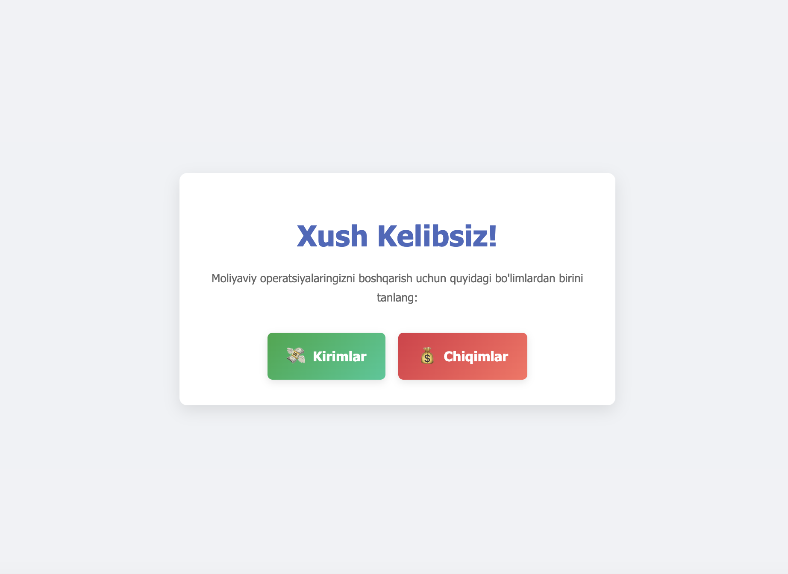
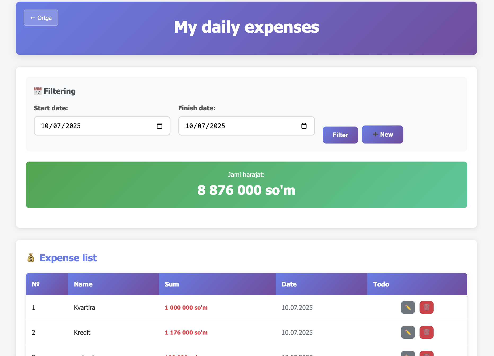
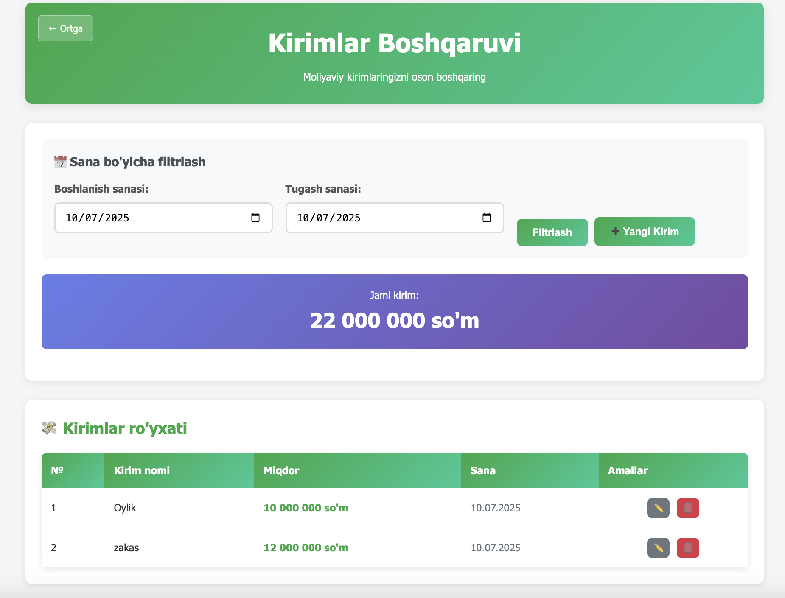

# 💰 FinDay app

Bu oddiy Django asosidagi veb-ilova bo'lib, sizga kundalik **kirimlaringiz** va **chiqimlaringizni** osongina kuzatib borish imkonini beradi. Uning yordamida moliyaviy ahvolingizni filtrlash, tahrirlash va o'chirish orqali samarali boshqarishingiz mumkin.

---

## Xususiyatlari:

* **Kirimlar va Chiqimlarni qo'shish:** Kirim va chiqim operatsiyalarini tezda kiritish.
* **Sana bo'yicha filtrlash:** Ma'lum sanalar oralig'idagi operatsiyalarni ko'rish.
* **Tahrirlash va O'chirish:** Mavjud yozuvlarni yangilash yoki olib tashlash.
* **Umumiy summani ko'rish:** Filtrlangan davr uchun jami kirim/chiqim summasini hisoblash.
* **Oddiy va tushunarli interfeys:** Foydalanishga qulay dizayn.

---

## O'rnatish:

Loyiha kodingizni mahalliy kompyuteringizda ishga tushirish uchun quyidagi amallarni bajaring:

1.  **Repozitoriyni klonlash:**
    ```bash
    git clone [https://github.com/SizningGithubUserName/my-finance-app.git](https://github.com/SizningGithubUserName/my-finance-app.git)
    cd my-finance-app
    ```

2.  **Virtual muhit yaratish va faollashtirish:**
    ```bash
    python -m venv venv
    # Windows:
    .\venv\Scripts\activate
    # macOS/Linux:
    source venv/bin/activate
    ```

3.  **Kerakli kutubxonalarni o'rnatish:**
    ```bash
    pip install -r requirements.txt
    ```

4.  **Ma'lumotlar bazasini sozlash:**
    ```bash
    python manage.py migrate
    ```

5.  **Ilovani ishga tushirish:**
    ```bash
    python manage.py runserver
    ```
    Endi brauzeringizda `http://127.0.0.1:8000/` manziliga o'ting.

---

## Skrinshotlar:

### Bosh sahifa
Asosiy navigatsiya sahifasi.


### Harajatlar ro'yxati
Harajatlarni ko'rish va boshqarish.


### Yangi Kirim qo'shish modali
Yangi kirimni qo'shish uchun modal oyna.


---

## Texnologiyalar:

* **Backend:** Python, Django
* **Frontend:** HTML, CSS, JavaScript (faqat oddiy DOM manipulyatsiyasi uchun)
* **Ma'lumotlar bazasi:** SQLite (standart Django bilan)

---

## Muallif:

[Sizning Ismingiz/Github Profilingizga havola]

---

## Litsenziya:

Bu loyiha MIT litsenziyasi ostida. Batafsil ma'lumot uchun `LICENSE` faylini ko'ring (agar mavjud bo'lsa).